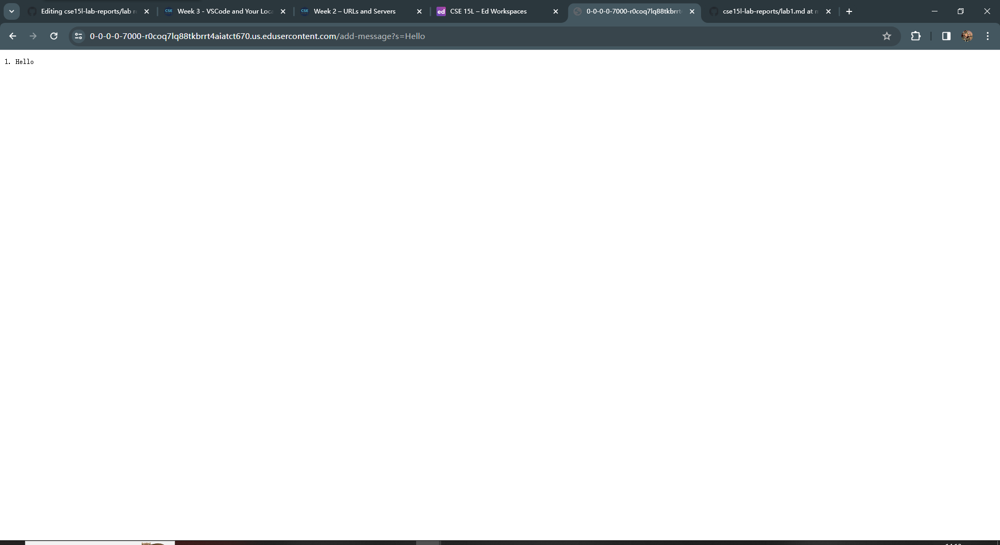
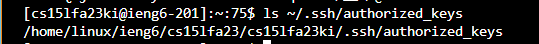
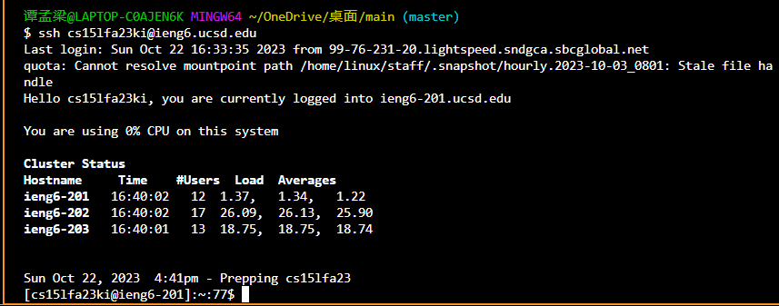

# Lab Report 2
## Part 1
- **CODE** :
```java
import java.io.IOException;
import java.net.URI;
import java.util.ArrayList;
import java.util.List;

class StringHandler implements URLHandler {
    private List<String> messages = new ArrayList<>();

    public String handleRequest(URI url) {
        if (url.getPath().equals("/")) {
            return String.join("\n", messages);
        } else if (url.getPath().equals("/add-message")) {
            String query = url.getQuery();
            if (query != null && query.startsWith("s=")) {
                String message = query.substring(2);
                System.out.println("Before adding message: " + messages);
                messages.add((messages.size() + 1) + ". " + message);
                System.out.println("After adding message: " + messages);
                return String.join("\n", messages);
            } else {
                return "Invalid request";
            }
        } else {
            return "404 Not Found!";
        }
    }
}

public class StringServer {
    public static void main(String[] args) throws IOException {
        if (args.length == 0) {
            System.out.println("Missing port number! Try any number between 1024 to 49151");
            return;
        }

        int port = Integer.parseInt(args[0]);
        Server.start(port, new StringHandler());
    }
}
```

- 
- **Methods Called**: `handleRequest`
- **Relevant Arguments**: `url` with value `new URI("/add-message?s=Hello")`
- **Values of Relevant Fields**: 
  -  `messages` = `[]` 
- **How Values Change**:
  - The value before was just '[]'
  - The `messages` list gets updated to `["1. Hello"]`
  - The code identifies a request to "/add-message" and extracts the message "Hello" from the URI query. It then adds "Hello" according to its sequence number prefix to the 'message' list.
 
- 
- **Methods Called:** :`handleRequest`
- **Relevant Arguments:** : `url` with value `new URI("/add-message?s=How+are+you+123")`
- **Values of Relevant Fields:** :`messages` = `["1. Hello"]`
- **How Values Change:** :
  - The value before is `["1. Hello"]`
  - The `messages` list gets updated to `["1. Hello", "2. How+are+you+123"]`
  - The code identifies a request to "/add-message" and extracts the message "How+are+you+123" from the URI query. It then adds "How+are+you+123" according to its sequence number prefix to the 'messages' list, which previously contained `["1. Hello"]`.

## Part 2
- 

- 
  
- 

  ## Part 3
- I have learned a lot in week 2 and 3. I did not know how to create and run your own local and remote server through using the terminal. And it is less complex then I thought it would be.  
  I also did not know how to set up SSH Keys for Easy Access by creating SSH key to bypass entering password.It saves a lot of time.
