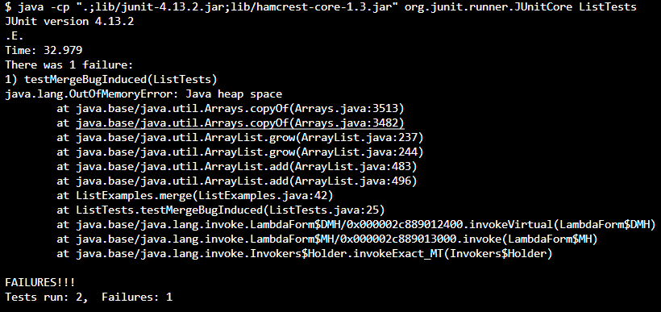

# Lab Report 3
## Part 1
- Code for A failure-inducing input for the buggy program:
``` java
import org.junit.Test;
import static org.junit.Assert.assertEquals;
import java.util.Arrays;
import java.util.List;

public class ListTests {
    @Test
    public void testMergeBugInduced() {
        List<String> list1 = Arrays.asList("apple");
        List<String> list2 = Arrays.asList("banana", "carrot");

        List<String> result = ListExamples.merge(list1, list2);
        List<String> expected = Arrays.asList("apple", "banana", "carrot");

        assertEquals( expected, result);
    }

```
- Code for An input that doesn’t induce a failure:
``` java
    @Test
    public void testMergeNoBugInduced() {
        List<String> list1 = Arrays.asList("apple", "banana");
        List<String> list2 = Arrays.asList();

        List<String> result = ListExamples.merge(list1, list2);
        List<String> expected = Arrays.asList("apple", "banana");

        assertEquals( expected, result);
    }
}
```

- 
- Bug Before Change:
  ```java
      while(index2 < list2.size()) {
      result.add(list2.get(index2));
      index1 += 1;
    }
  ```
- Bug After Change:  
 ```java
 while(index2 < list2.size()) {
      result.add(list2.get(index2));
      index2 += 1;
    }
 ```
- **The bug in the `merge` method of `ListExamples.java` was due to the incorrect increment of `index1` instead of `index2`,
  which led to an infinite loop and a heap space error when merging elements from `list2`. The fix changes the increment operation to `index2 += 1;`,
  thereby allowing the method to properly iterate through and merge elements from both lists. This adjustment ensures that the merge completes correctly, with all elements ordered as intended.**

## Part 2
- ```
  $  find ./technical -empty

  ```
- The command searches for and lists all empty files and directories within the ./technical directory, which is helpful for identifying and possibly cleaning up unused files.

- ```
  $ find ./technical/911report -empty
 
  ```
- The command searches for and lists all empty files within the ./technical/911report directory.   
Returning nothing means there are no empty files or directories in it.
The command option is found in https://www.geeksforgeeks.org/find-command-in-linux-with-examples/

- ```
  $ find . -type d
  .
  ./911report
  ./biomed
  ./government
  ./government/About_LSC
  ./government/Alcohol_Problems
  ./government/Env_Prot_Agen
  ./government/Gen_Account_Office
  ./government/Media
  ./government/Post_Rate_Comm
  ./plos
  ```
- The command lists all directories within the current directory. The output shows the directory structure starting from the current directory, including all subdirectories. This command is useful for getting an overview of the directory hierarchy. 

- ```
  $ find . -type d
  .
  ```
- The command lists all directories within the current directory. This shows nothing because there is subdirectories under ./technical/biomed. 
The command option is found from https://www.geeksforgeeks.org/find-command-in-linux-with-examples/

- ```
  $ find ./technical/911report -type f -newer ./technical/911report/chapter-1.txt

  ```
- This command searches within the ./technical/911report directory for files (-type f) that have been modified more recently than ./technical/911report/chapter-1.txt.
  This command is executed and returns no output, it means there are no files in the ./technical/911report directory that were modified after chapter-1.txt.
  This is particularly useful for identifying recent changes or updates, allowing users to focus on newly modified files for review, backup, or further processing.
-  ```
   $ find ./technical/911report -type f -newer ./technical/911report/chapter-2.txt

   ```
- This command searches within the ./technical/911report directory for files (-type f) that have been modified more recently than ./technical/911report/chapter-2.txt.
  This command is executed and returns no output, it means there are no files in the ./technical/911report directory that were modified after chapter-2.txt.
  The command option is found from https://www.geeksforgeeks.org/find-command-in-linux-with-examples/
- ```
  $ find ./technical/biomed -type f -size +50k
  ./technical/biomed/1471-2091-3-14.txt
  ./technical/biomed/1471-2091-3-31.txt
  ./technical/biomed/1471-2091-3-4.txt
  ./technical/biomed/1471-2105-2-8.txt
  ./technical/biomed/1471-2105-3-14.txt
  ./technical/biomed/1471-2105-3-18.txt
  ./technical/biomed/1471-2105-3-2.txt
  ./technical/biomed/1471-2121-2-10.txt
  ./technical/biomed/1471-2121-3-15.txt
  ./technical/biomed/1471-2121-3-16.txt
  ./technical/biomed/1471-2121-3-25.txt
  ./technical/biomed/1471-2121-3-30.txt
  ./technical/biomed/1471-213X-3-3.txt
  ./technical/biomed/1471-2164-4-4.txt
  ./technical/biomed/1471-2199-2-4.txt
  ./technical/biomed/1471-2202-3-1.txt
  ./technical/biomed/1471-2210-1-7.txt
  ./technical/biomed/1471-2253-2-5.txt
  ./technical/biomed/1472-6807-3-1.txt
  ./technical/biomed/1472-6882-1-10.txt
  ./technical/biomed/1472-6904-2-5.txt
  ./technical/biomed/1472-6904-3-1.txt
  ./technical/biomed/1475-4924-1-10.txt
  ./technical/biomed/1476-069X-2-4.txt
  ./technical/biomed/1476-069X-2-9.txt
  ./technical/biomed/1476-072X-2-4.txt
  ./technical/biomed/1476-511X-1-2.txt
  ./technical/biomed/1477-7827-1-13.txt
  ./technical/biomed/1477-7827-1-36.txt
  ./technical/biomed/gb-2001-2-11-research0046.txt
  ./technical/biomed/gb-2001-2-7-research0025.txt
  ./technical/biomed/gb-2001-3-1-research0001.txt
  ./technical/biomed/gb-2002-3-10-research0052.txt
  ./technical/biomed/gb-2002-3-11-research0059.txt
  ./technical/biomed/gb-2002-3-11-research0065.txt
  ./technical/biomed/gb-2002-3-12-research0071.txt
  ./technical/biomed/gb-2002-3-12-research0072.txt
  ./technical/biomed/gb-2002-3-12-research0079.txt
  ./technical/biomed/gb-2002-3-12-research0083.txt
  ./technical/biomed/gb-2002-3-12-research0086.txt
  ./technical/biomed/gb-2002-3-12-research0088.txt
  ./technical/biomed/gb-2002-3-7-research0036.txt
  ./technical/biomed/gb-2002-3-9-research0043.txt
  ./technical/biomed/gb-2002-3-9-research0045.txt
  ./technical/biomed/gb-2003-4-2-r14.txt
  ./technical/biomed/gb-2003-4-2-r9.txt
  ./technical/biomed/gb-2003-4-3-r17.txt
  ./technical/biomed/gb-2003-4-4-r26.txt
  ./technical/biomed/gb-2003-4-5-r34.txt
  ./technical/biomed/gb-2003-4-7-r42.txt
  ./technical/biomed/gb-2003-4-7-r43.txt
  ```
- This searched for files larger than 50 kilobytes within the ./technical/biomed directory. The listed files are all the ones that met the criteria. This command is useful for identifying larger text files, possibly to prioritize them for review or processing, or to manage disk space usage.
- ```
  $ find ./technical/plos -type f -size +30k
  ./technical/plos/pmed.0010028.txt
  ./technical/plos/pmed.0010036.txt
  ./technical/plos/pmed.0020018.txt
  ./technical/plos/pmed.0020045.txt
  ./technical/plos/pmed.0020059.txt
  ./technical/plos/pmed.0020073.txt
  ./technical/plos/pmed.0020103.txt
  ./technical/plos/pmed.0020182.txt
  ./technical/plos/pmed.0020246.txt
  ./technical/plos/pmed.0020249.txt
  ```
- It identified files within the ./technical/plos directory that are larger than 30 kilobytes. This information can be valuable for tasks such as data analysis, where file size may correlate with the length or detail of content, or simply for managing storage by identifying larger files.
  It was found from https://www.geeksforgeeks.org/find-command-in-linux-with-examples/
