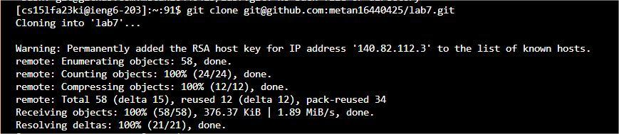

# Lab Report 4
- Step 4:  
    
  Keys pressed: `ssh cs15lfa23ki@ieng6.ucsd.edu` + `<enter>`   
  Effect: Initiates an SSH connection to my ieng6 account. 
- Step 5. Clone your fork of the repository from your Github account (using the SSH URL):  
    
  Keys pressed: `git clone git@github.com:your_username/your_repository.git` + `<enter>`    
  Effect: Clones your GitHub repository onto the ieng6 server.  
- Step 6. Run the tests, demonstrating that they fail:
    
  Keys pressed: `cd (lab7)` + `<enter>` + `bash test.sh`.  
  Effect: Navigate to the directory and Execute the test. The tests should fail, showing the initial problem.
- Step 7. Edit the code file to fix the failing test:
  
