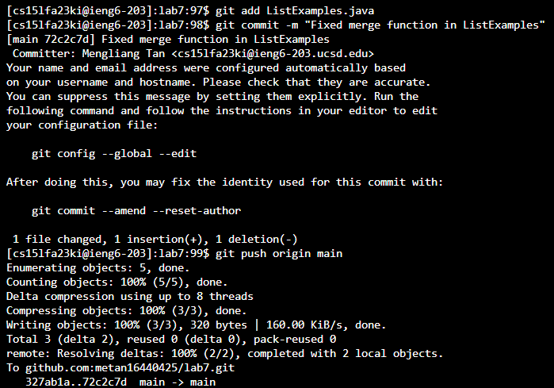

# Lab Report 4
- Step 4:  
    
  Keys pressed: `ssh cs15lfa23ki@ieng6.ucsd.edu` + `<enter>`   
  Effect: Initiates an SSH connection to my ieng6 account. 
- Step 5. Clone your fork of the repository from your Github account (using the SSH URL):  
  (1).png)  
  Keys pressed: `git clone git@github.com:your_username/your_repository.git` + `<enter>`    
  Effect: Clones your GitHub repository onto the ieng6 server.  
- Step 6. Run the tests, demonstrating that they fail:
    
  Keys pressed: `cd (lab7)` + `<enter>` + `bash test.sh`
  Effect: Navigate to the directory and Execute the test. The tests should fail, showing the initial problem.
- Step 7. Edit the code file to fix the failing test:
  
  1. Keys pressed: `vim ListExamples.java` + `<enter>`  
     Effect: Opens ListExamples.java in Vim for editing.
  2. Keys pressed: `/index1` + `<Enter>` + `nnnnnnnnn` + `llllll`     
     Effect: Searches for the first occurrence of "index1" in the file. Pressing `n` 9 times to jump to the the occurrence we desired. Then press 'l' six times to move the cursor to the location where we want to make the change  
  3. Keys pressed: 'i' + '<backspace>' + '2' + `<Esc>` + `:wq`  
     Effect: Enter the insert mode, and correctly modifies the line to increment index2 instead. In the end, Saves the changes and exits Vim.
- Step 8. Run the tests, demonstrating that they now succeed:  
    
  Key Pressed: `<up><up><enter>`   
  Effect: Enter 'bash test.sh' to run the test. It was 4 up in the search history, so I used up arrow to access it.  
- Step 9. Commit and push the resulting change to your Github account:  
     
  Key pressed: `git add ListExamples.java` + `<Enter>`  
               `git commit -m "Fixed merge function in ListExamples"` + `<Enter>`    
               `git push origin main` + `<Enter>`  
  Effects: After staging the changes with git add ListExamples.java, which marks the modified file for inclusion in the next commit, you can create a new commit using git commit -m "Fixed merge function in ListExamples". This command records the changes in the repository's history, along with a message describing what was fixed. Finally, git push origin main sends these committed changes to the main branch of the remote GitHub repository, updating it with your latest code modifications. 

  
  
