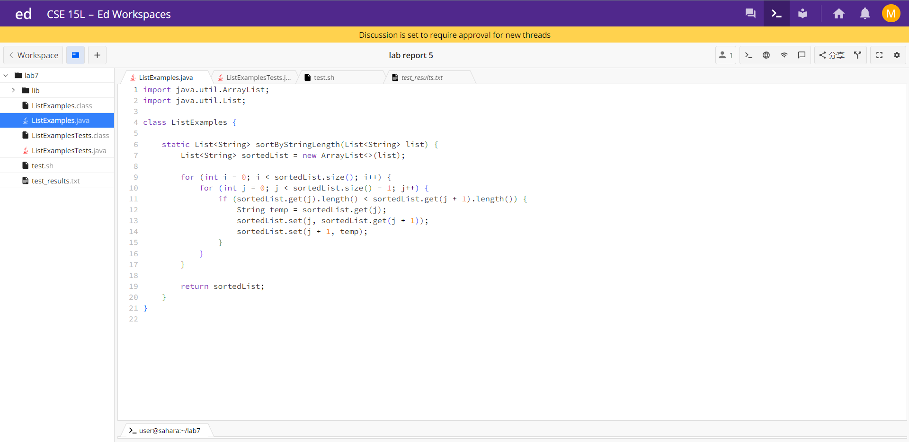
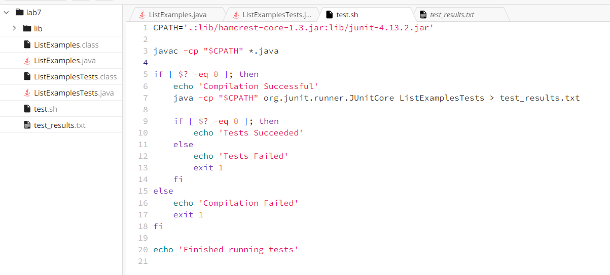
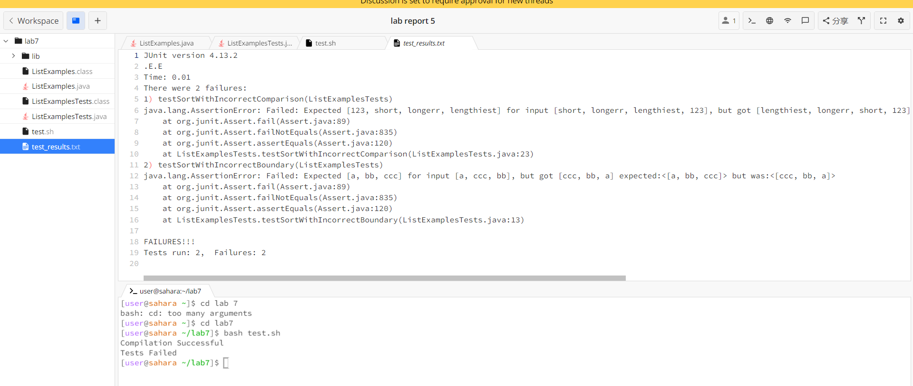
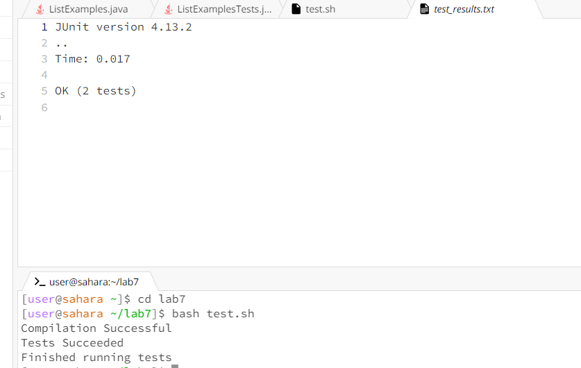
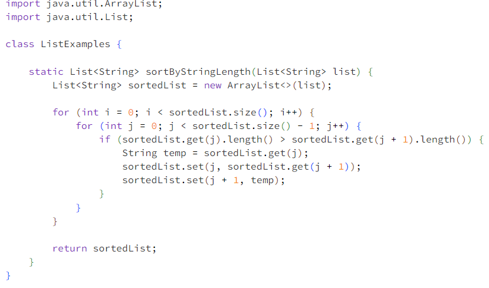
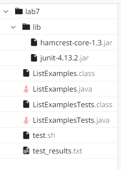

# Lab Report 5
## Part 1
### Student:

Hi all,  

I'm working on a Java method to sort strings in a list by their length. However, it's not working as expected. I expect it to be in ascending order, but it is in descending order. When I run my tests, the strings don't seem to be sorted correctly. 

I suspect there might be an issue with the sorting logic or the comparison inside the sortByStringLength method.  

**Code:** 

**Code for Testing:**
  
**Bash Script:**

**Result of running the bash script:**


### TA:

Thank you for providing the terminal output and your code. It looks like the issue lies in your sorting algorithm. The sorting is currently happening in descending order of string length, but you want it to be in ascending order. To fix this, you should modify the comparison condition in your `sortByStringLength` method.

Change this line in your `ListExamples.java`:

```java
if (sortedList.get(j).length() < sortedList.get(j + 1).length())
```
to:
```java
if (sortedList.get(j).length() > sortedList.get(j + 1).length())
```

### Student:

Hi! Thanks for your response. I ran the command you suggested, and here's the terminal output:  
  
The bug in the original code is in the sortByStringLength method of the ListExamples class, specifically in the way it attempts to sort a list of strings by their length in descending order. The bug arises from an incorrect comparison condition within a nested loop that is responsible for sorting the strings. It occurs because this comparison condition is set to check for strings of longer length coming before shorter ones, which effectively sorts the list in descending order by string length instead of ascending order as intended. As a result, when the code is executed, it produces a sorted list that is in descending order of string length, rather than the desired ascending order.

### Description of fixing the bug:
1. Open the `ListExamples.java` file in your code editor.

2. Locate the `sortByStringLength` method within the `ListExamples` class.

3. Inside the `sortByStringLength` method, find the following line of code:

   ```java
   if (sortedList.get(j).length() < sortedList.get(j + 1).length())
   ```
   to:
   ```java
   if (sortedList.get(j).length() > sortedList.get(j + 1).length())
   ```

   
**Code after fixing the bug:**  



**File Structure:**  



**The contents of each file before fixing the bug:** 
They are shown in previous images.  

