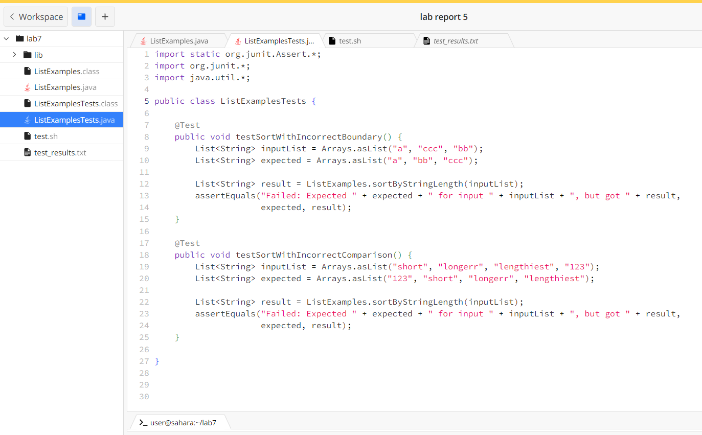

# Lab Report 5
## Part 1
### Student:

Hi all,  

I'm working on a Java method to sort strings in a list by their length. However, it's not working as expected. I expect it to be in ascending order, but it is in descending order. When I run my tests, the strings don't seem to be sorted correctly. 

I suspect there might be an issue with the sorting logic or the comparison inside the sortByStringLength method.  

**Code:** 

**Code for Testing:**
  
**Bash Script:**

**Result of running the bash script:**

