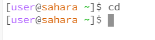
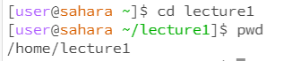
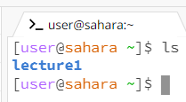
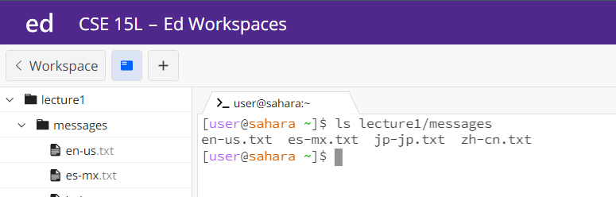
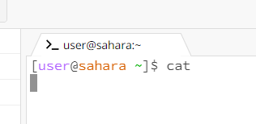
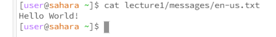

# Lab Report 1
## cd:
1. No Argument:  
         
   Working directory is /home.  
   When cd is executed without any arguments, it changes the current working directory to the user's home directory. And I am already in the home directory, so no change noticed.  
   There is no error.
2. Directory:  
     
   No output is shown in the terminal.  
   The current working directory is /home.    
   The command changes the current working directory to the specified directory.  
   No error
3. File:  
     
   Working directory is /home.   
   I got the output because the cd command navigates directories, not files.  
   It is an error. Because it is provided with a path to the file.
## ls:
1. No Argument:  
      
   Working directory is /home.  
   The ls command with no arguments will list the contents of the current directory.  
   No Error
2. Directory:  
     
    Working directory is /home.  
   It lists the contents of the specified directory.  
   No Error
3. File:  
  .  
   working directory: /home  
   When given a path as an argument, ls will just display the name of that file.  
   No Error
## cat:
1. No Argument:  
     
   Working Directory: /home  
   There is nothing because cat is expecting an input, and it now waits for users to input something.  
   No Error
2. Directory:  
   .  
   Working Directory: /home  
   Directories do not have content to display. So it informs that it is a directory.  
   It is an error. Because cat expects files not a directory.
 3. File:  
      
    Working Directory: /home  
    The cat command, when provided with a file path as an argument, reads the file and displays its content on output.  
    No Error
